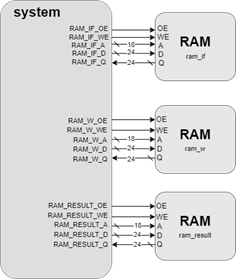
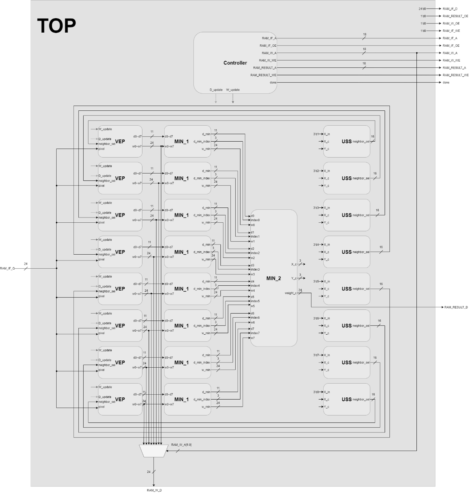

# Self-Organizing Map (SOM) Processing System

## Overview

This project implements a Self-Organizing Map (SOM) processing system in Verilog. The design integrates multiple hardware modules — VEP, MIN_1, MIN_2, USS, Controller, RAM, and Top — to perform:

 - Pixel input from memory

 - Manhattan distance calculation

 - Weight updates and codebook training

 - Lossy image compression (mapping pixels to codebook tags)

The system was developed in two phases:

 - Phase 1: Single-image training and compression (shorter cycle count, faster simulation).

 - Phase 2: Multi-image training (larger cycle count, longer simulation, codebook dominated by skin-tone pixels for better generalization).

## System Architecture

Main modules:

 - VEP – Computes Manhattan distances and updates weights based on neighbor_sel.

 - MIN_1 – Local minimum selector using a three-level MUX structure.

 - MIN_2 – Global minimum selector across multiple MIN_1 results.

 - USS – Generates neighbor_sel signals with simplified case rules.

 - Controller – FSM with six states: INS → MAN_MIN_SEL → UPDATE → W_WEIGHT → W_PIC → DONE.

 - RAM – Models input (RAM_if), codebook (RAM_w), and output (RAM_result) memories.

 - Top – Integrates all modules into the complete SOM system.

 - top_tb – Testbench for simulation.

## Simulation Flow

Phase 1 (Training)
 1. Read pixels from RAM_if.

 2. Compute Manhattan distance (VEP → MIN_1 → MIN_2).

 3. Generate neighbor_sel (USS) and update weights.

 4. Write trained codebook into RAM_w.

Phase 2 (Inference)

 1. Read pixels again from RAM_if.

 2. Map each pixel to its nearest codebook entry.

 3. Write compressed results into RAM_result.

 4. Assert done when all pixels are processed.

## Results
 - Clock period: ~7.8–7.9 ns
 - Cell area: ~22.6K
 - SuperLint coverage: ~94.75%

Post-simulation time:

 - Phase 1 (single image): ~9.6e7 ps

 - Phase 2 (10 images): ~8.1e8 ps (~10× longer)

Codebook observation:

 - Phase 1: Mixed colors when trained on a single image

 - Phase 2: Dominated by skin-tone pixels, improving compression across multiple faces

M.S. in Electrical & Computer Engineering, Texas A&M University
